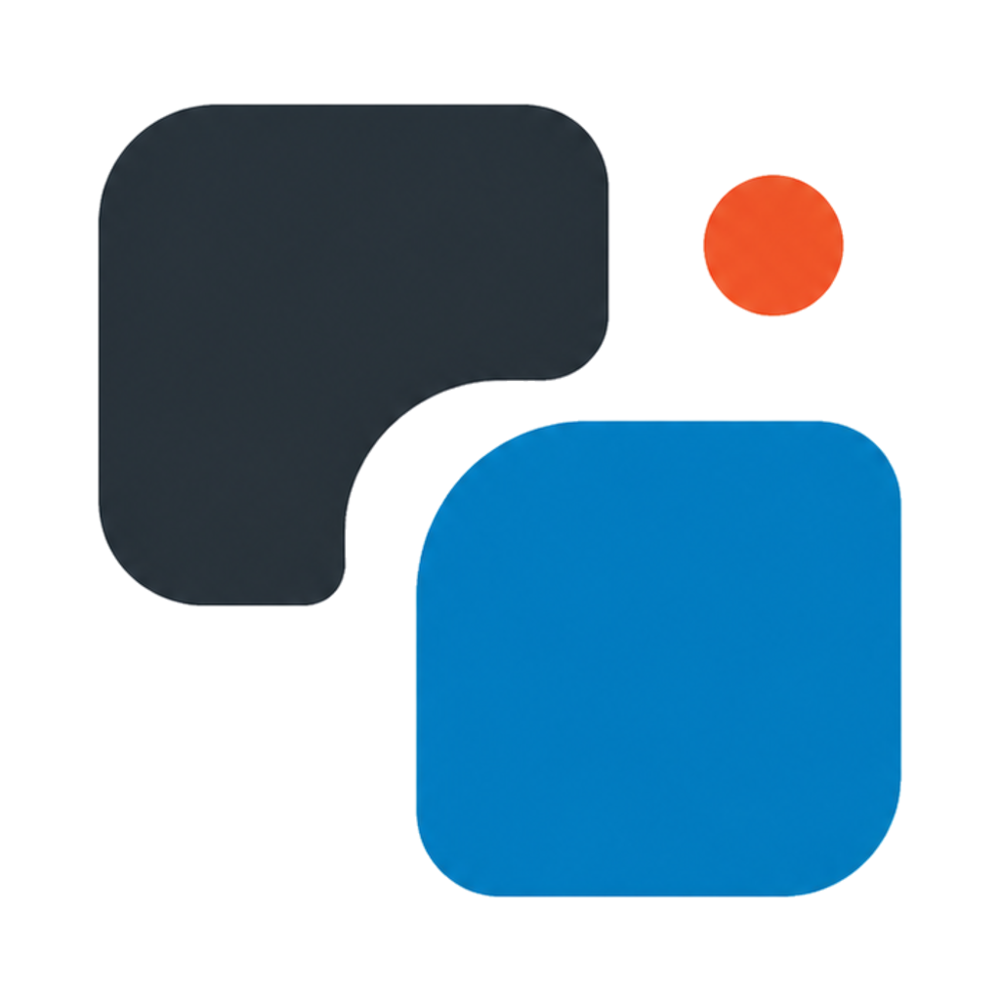

<div align="center">



# Noti Shift

English | [简体中文](README.zh-CN.md)

Control system notification banner position on macOS.

[](https://github.com/fthux/NotiShift/commits/master/)
[](LICENSE)
[](https://sonarcloud.io/summary/new_code?id=fthux_NotiShift)

[](https://sonarcloud.io/summary/new_code?id=fthux_NotiShift)
[](https://sonarcloud.io/summary/new_code?id=fthux_NotiShift)
[](https://sonarcloud.io/summary/new_code?id=fthux_NotiShift)

[](https://sonarcloud.io/summary/new_code?id=fthux_NotiShift)
[](https://sonarcloud.io/summary/new_code?id=fthux_NotiShift)
[](https://deepwiki.com/fthux/NotiShift)


</div>

## Installation

```bash
brew install fthux/brew/notishift
```

Run after installation:

```bash
notishift
```

## Usage

Noti Shift needs Accessibility permission to move notification banners。The app lives in the menu bar. You can set system notification banners to appear in 9 positions.

<div align="center">


</div>

## Requirements

- macOS 11.0 or later
- Accessibility permission

## License

GNU Affero General Public License v3.0. See [LICENSE](LICENSE).
