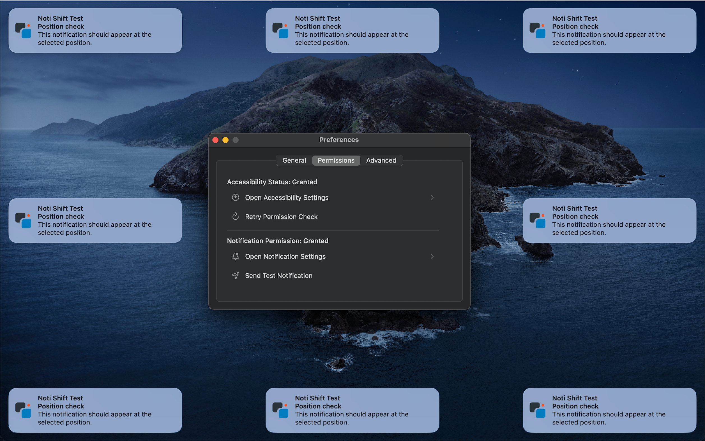

<div align="center">


# Noti Shift

简体中文 | [English](README.md)

控制 macOS 系统通知横幅的位置。

[](https://deepwiki.com/fthux/NotiShift)



</div>

## 安装

```bash
brew install fthux/brew/notishift
```

安装后运行：

```bash
notishift
```

## 使用

Noti Shift 需要辅助功能权限才能移动通知横幅，应用会常驻菜单栏。可以将系统通知横幅设置到 9 个位置。

<div align="center">


</div>

## 系统要求

- macOS 11.0 或更高版本
- 辅助功能权限

## 许可证

GNU Affero General Public License v3.0。详见 [LICENSE](LICENSE)。
